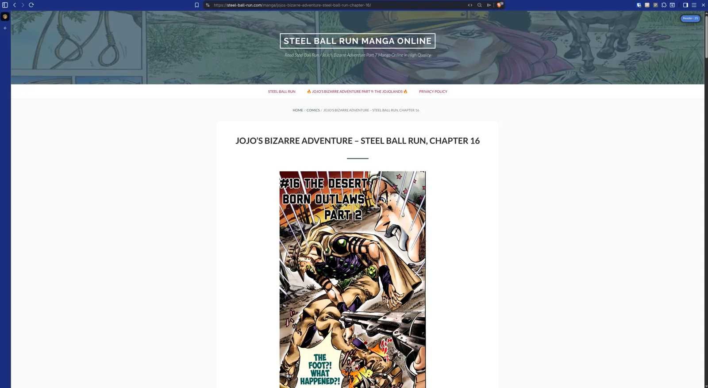
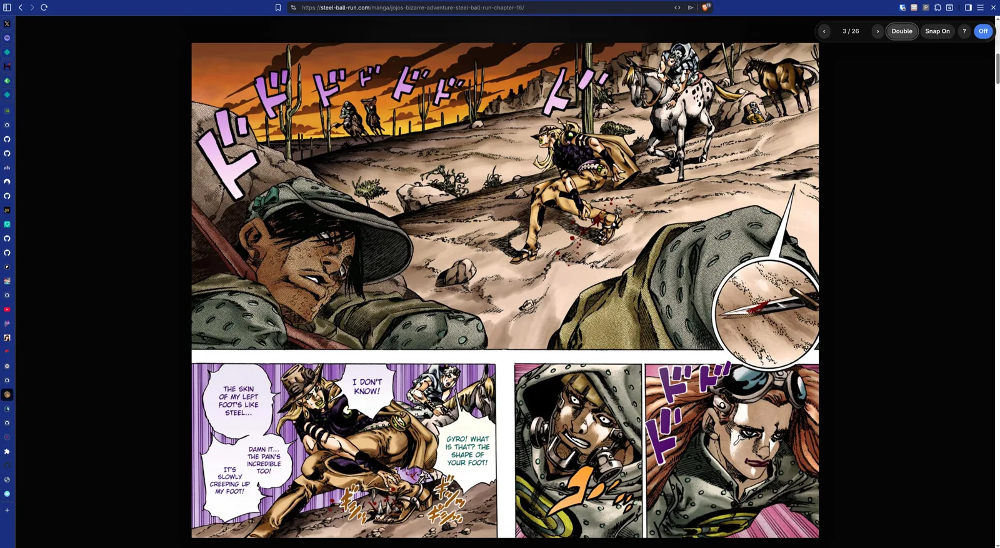
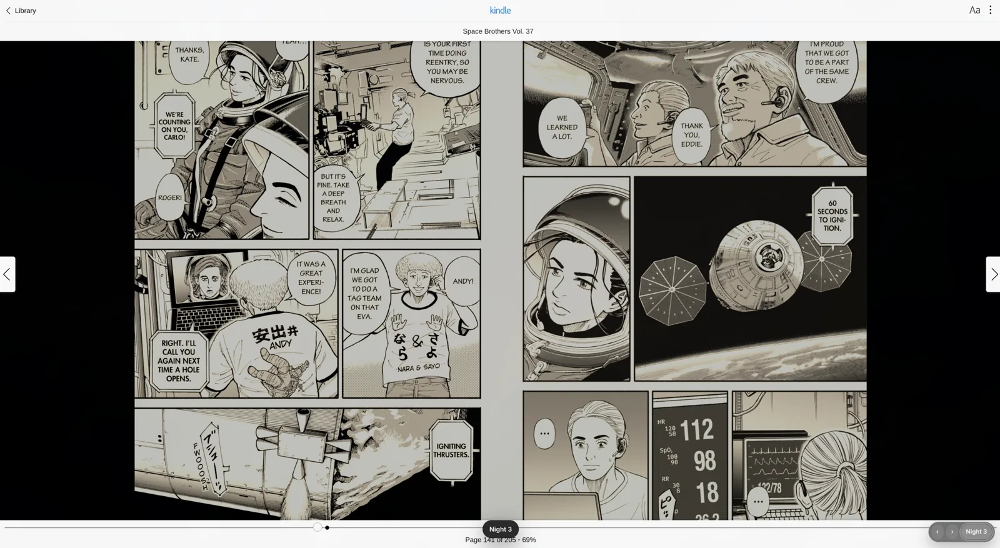

# Prettify Manga Reader

<video src="assets/demo.mp4" controls muted loop playsinline width="100%"></video>

Demo video: [`assets/demo.mp4`](assets/demo.mp4)

Did you know many manga artists compose key moments as two-page spreads? If you read on typical fansub sites, you are probably missing many of them because most of those pages only show one long, vertical, single-page scroll.

Prettify Manga Reader restores more of the artist's original intent. It turns ugly, ad-bloated manga websites into a modern dark-mode reader with fitted pages, joined two-page spreads, keyboard navigation, and clean controls. It is generic by design, so it works across most manga sites instead of being hardcoded to one domain.

It also includes a small Kindle Web Reader helper for manga opened on country reader domains such as `read.amazon.com`, `read.amazon.co.jp`, `read.amazon.co.uk`, and matching `read.kindle.*` hosts.

## Before: the usual fansub page

Most sites bury manga pages inside a bright, cluttered layout and make you scroll one page at a time.



## After: a dark reader that restores spreads

The extension opens a dark overlay, fits the art to the viewport, and joins pages at the center seam when Book or Double mode is active.



## What it does

- Adds a toggleable full-screen reader overlay.
- Fits each manga page to the available screen space.
- Supports Single, Double, and Book spread modes.
- Starts in Book mode whenever the reader opens: first page alone, then double-page spreads.
- Joins paired pages in the middle for seamless two-page art spreads.
- Keeps already-horizontal spread images as single full-width spreads.
- Uses scroll snapping so page/spread navigation lands cleanly.
- Adds a 3-level night filter to soften harsh white manga pages without flattening contrast.
- Adds keyboard shortcuts and small mouse controls.
- Adds an end-of-chapter card with detected previous/next chapter links when confidence is high.
- Adds Kindle Web Reader manga shortcuts and a small night-filter toolbar on Amazon/Kindle country reader domains.

## Install locally

### From a release zip

1. Download `prettify-manga-reader-<version>.zip` from the release.
2. Unzip it into a permanent directory.
3. Open `chrome://extensions` or `brave://extensions`.
4. Enable **Developer mode**.
5. Click **Load unpacked**.
6. Select the unzipped directory.

### From source

1. Run `npm test`.
2. Run `npm run package`.
3. Unzip `dist/prettify-manga-reader-<version>.zip`.
4. Load the unzipped directory from `chrome://extensions` with Developer mode enabled.

You can also load this repository directory directly while developing.

## Use

- Click the extension icon, or the small **Reader** pill that appears when a likely manga page sequence is detected.
- Click **Off** or press `Esc` to turn the reader off.
- Press `?` for help inside the reader.

## Shortcuts

| Shortcut | Action |
| --- | --- |
| `Space`, `PageDown`, `Down`, `Right` | Next page/spread |
| `Shift+Space`, `PageUp`, `Up`, `Left` | Previous page/spread |
| `Home` | Start of chapter |
| `End` | End of chapter / chapter nav card |
| `D` | Cycle `Single → Double → Book` |
| `S` | Toggle scroll snap |
| `N` | Cycle `Night Off → Night 1 → Night 2 → Night 3` |
| `?` | Help |
| `Esc` | Close help or turn reader off |

## Reader modes

- **Single**: one fitted page per screen.
- **Double**: pairs portrait pages side-by-side from the start, displayed right-to-left for manga.
- **Book**: keeps the first page alone, then pairs the rest right-to-left. This is the mode used each time the reader opens.

Horizontal images, such as scans that already contain a two-page spread, stay as one full-width spread in Double and Book modes.

While the reader is active, the original page is not deleted. It is hidden and suspended from normal painting behind the overlay, which is safer for toggling off and avoids breaking site scripts while reducing unnecessary background rendering.

## Night filter

Press `N` or click the **Night** toolbar button to cycle through three warmer, dimmer image filters. The filters use sepia, brightness, and contrast adjustments to make white pages less harsh without turning manga art into a flat gray wash.

## Kindle Web Reader manga support



On manga URLs like `read.amazon.com/manga/...`, `read.amazon.co.jp/manga/...`, or other supported country reader hosts, the extension does not rebuild the book into its own overlay. Instead, it adds a small bottom-right toolbar and keyboard bindings on top of Amazon's native reader:

- `Space`, `PageDown`, `Down`, `Right`: next page
- `Shift+Space`, `PageUp`, `Up`, `Left`: previous page
- `Home` / `End`: beginning/end of the chapter when the native reader accepts those keys, with a scroll fallback
- `N` or the toolbar **Night** button: cycle `Night Off → Night 1 → Night 2 → Night 3`

The Kindle helper is host-gated to `read.amazon.*` and `read.kindle.*` country reader domains and `/manga/...` paths. It does not store Amazon credentials or session data, and no account-specific data is needed in the source tree.

## Generic detection approach

The extension is not hardcoded to the tested sites. It detects likely manga pages by combining:

- normal and lazy image attributes: `src`, `currentSrc`, `data-src`, `data-lazy-src`, `data-full-image`, `srcset`
- image links around pages
- image preloads
- repeated OpenGraph/Twitter image tags when they form a sequence
- image URLs embedded in `noscript` or inline app payloads
- scoring for large/tall images, sequential filenames, repeated URL families, and `alt="Page N"`
- negative scoring for banners, ads, logos, favicons, avatars, placeholders, and common ad dimensions

Previous/next chapter detection is deliberately conservative. It prefers `rel="prev"` / `rel="next"`, WordPress post navigation, explicit `Previous Chapter` / `Next Chapter` text, or chapter-number links near chapter selectors. It rejects ads, social links, feeds, comments, login/register links, and ordinary pagination like `/page/2`.

## Patterns found in sampled sites

- WordPress/ComicEasel/Blogger-style chapters: repeated `div.separator > a > img`, often numbered `001.jpg`, `002.jpg`, etc.
- Lazy-loaded pages: placeholder SVG in `src`, real image in `data-lazy-src` or `data-src`.
- WordPress block pages: tall `wp-image-*` images named like `01-title-chapter-123.webp`.
- Next.js pages: scan URLs in preloads/app payloads and DOM images with `alt="Page 1"`.

## Files

- `manifest.json`: Chrome MV3 manifest.
- `background.js`: extension-action toggle and fallback content-script injection.
- `content.js`: manga page detection, reader UI, spread layout, shortcuts, chapter navigation.
- `content.css`: overlay, controls, page fitting, double-spread layout.
- `assets/demo.mp4`: optimized showcase video.
- `assets/screenshot-kindle.webp`: Kindle Web Reader helper screenshot.

## Development and release

```bash
npm test
npm run package
```

The package command writes `dist/prettify-manga-reader-<version>.zip`. Tagged releases named `v<version>` build the zip in GitHub Actions and attach it to the GitHub release.
